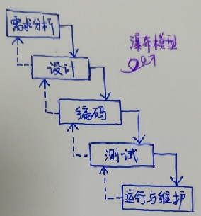
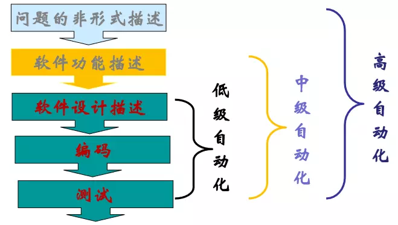
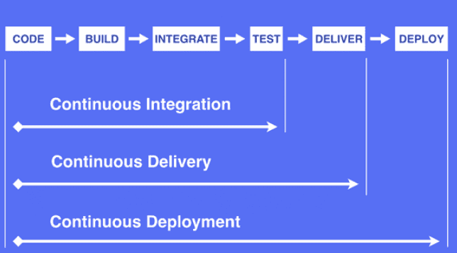
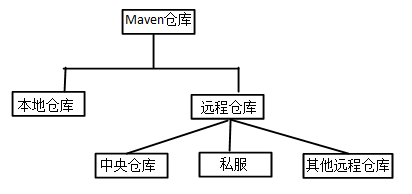
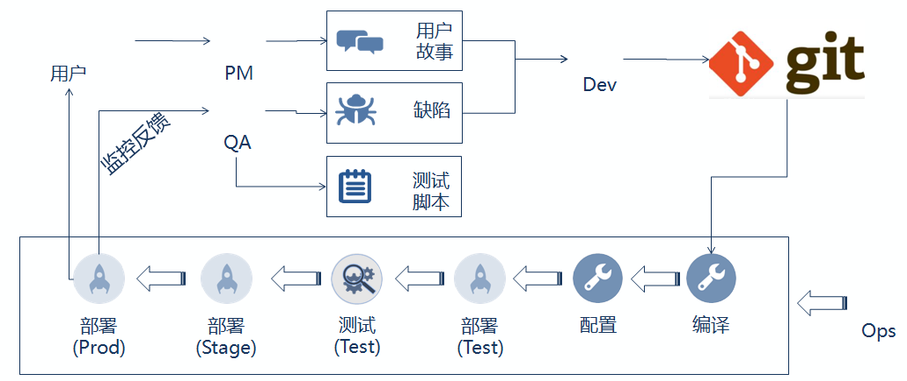

# 理解DevOps及其相关概念 （2019.9.4-2019.9.5）

## 1.DevOps

### 1.1.定义

##### DevOps一词的来自于Development和Operations的组合，以 IT 自动化以及持续集成（CI）、持续部署（CD）为基础，突出重视软件开发人员和运维人员的沟通合作，通过自动化流程来使得软件构建、测试、发布更加快捷、频繁和可靠。

### 1.2.一些名词

#### 1.2.1.敏捷

##### 敏捷是相对于瀑布模型来说的。瀑布模型是将软件生存周期中的各个活动规定为依线性顺序连接的若干阶段的模型，包括需求分析、设计、编码、测试、运行和维护。它规定了由前至后、相互衔接的固定次序，如同瀑布流水逐级下落：



##### 但是瀑布模型的缺点是：

+ ##### 各个阶段的划分完全固定，阶段之间产生大量的文档，极大地增加了工作量。

+ ##### 由于开发模型是线性的，用户只有等到整个过程的末期才能见到开发成果，从而增加了开发风险。

+ ##### 通过过多的强制完成日期和里程碑来跟踪各个项目阶段。

+ ##### 瀑布模型的突出缺点是不适应用户需求的变化。

##### 为了避免瀑布式开发的问题，敏捷开发应运而生。

```
敏捷开发以用户的需求进化为核心，采用迭代、循序渐进的方法进行软件开发。
```

##### 在敏捷开发中，软件项目在构建初期被切分成多个子项目，各个子项目的成果都经过测试，具备可视、可集成和可运行使用的特征。换言之，就是把一个大项目分为多个相互联系，但也可独立运行的小项目，并分别完成，在此过程中软件一直处于可使用状态。

##### 敏捷开发的高适应性，以人为本的特性，和轻量型的开发方法即以测试为驱动取代了以文档为驱动，这三个主要的特点， 也就是敏捷开发相对与传统开发方式的主要有点。因为它更加的灵活并且更加充分的利用了每个开发者的优势，调动了每个人的工作热情。

#### 1.2.2.自动化

##### 软件自动化方法是借助计算机系统实现软件开发的方法。以软件控制论为指导，将控制理论应用于软件工程领域，以软件过程作为被控对象，通过分析和优化软件过程中的反馈机理，达到改进软件过程、提高软件质量的目的。



##### 开发工作大致流程：code → build → unit test → integrate → test（集成测试、端到端测试等） →deliver → deploy



##### 持续集成、持续交付、持续部署就是典型的自动化技术。

#### 1.2.3.持续集成（CI）

##### **持续集成**（Continuous integration）指的是，频繁地（一天多次）将代码集成到主干。将软件个人研发的部分向软件整体部分交付，频繁进行集成以便更快地发现其中的错误。

##### 优点是：

+ ##### 快速发现错误。每完成一点更新，就集成到主干，可以快速发现错误，定位错误也比较容易；

+ ##### 防止分支大幅偏离主干。如果不是经常集成，主干又在不断更新，会导致以后集成的难度变大，甚至难以集成。

##### 持续集成并不能消除Bug，而是让它们非常容易发现和改正。持续集成的目的，就是让产品可以快速迭代，同时还能保持高质量。它的核心措施是，代码集成到主干之前，必须通过自动化测试。只要有一个测试用例失败，就不能集成。

#### 1.2.4.持续交付

##### 持续交付（Continuous delivery）指的是，频繁地将软件的新版本，交付给质量团队或者用户，以供评审。如果评审通过，代码就进入生产阶段。

##### 持续交付在持续集成的基础上，将集成后的代码部署到更贴近真实运行环境的类生产环境(production-like environments)中。持续交付优先于整个产品生命周期的软件部署，建立在高水平自动化持续集成之上。

#### 1.2.5.持续部署（CD）

##### **持续部署**（continuous deployment）是持续交付的下一步，指的是代码通过评审以后，自动部署到生产环境。

##### 持续部署的目标是，代码在任何时刻都是可部署的，可以进入生产阶段。持续部署的前提是能自动化完成测试、构建、部署等步骤。

#### 1.2.6.微服务

##### 微服务架构风格是一种使用一套小服务来开发单个应用的方式途径，每个服务运行在自己的进程中，并使用轻量级机制通信，这些服务基于业务能力构建，并能够通过自动化部署机制来独立部署，这些服务使用不同的编程语言实现，以及不同数据存储技术，并保持最低限度的集中式管理。

##### 为什么需要微服务？在传统的IT行业软件大多都是各种独立系统的堆砌，这些系统的问题总结来说就是扩展性差，可靠性不高，维护成本高。

##### 微服务的目的是有效的拆分应用，实现敏捷开发和部署。微服务提倡的理念团队间应该是 inter-operate, not integrate 。inter-operate是定义好系统的边界和接口，在一个团队内全栈，让团队自治，原因就是因为如果团队按照这样的方式组建，将沟通的成本维持在系统内部，每个子系统就会更加内聚，彼此的依赖耦合能变弱，跨系统的沟通成本也就能降低。

### 1.3.为什么使用DevOps

##### 既然敏捷开发效果很好，那为什么不直接使用敏捷开发呢？

##### 敏捷开发虽然开发效果特别好，但是频繁的变更造成了运维的困难。DevOps是为了填补开发端和运维端之间的信息鸿沟，改善团队之间的协作关系。

##### 那为什么不放慢部署的速度来达到稳定性呢？

##### 快速的部署其实可以帮助更快地发现问题，产品被更快地交付到用户手中，团队可以更快地得到用户的反馈，从而进行更快地响应。而且，DevOps小步快跑的形式带来的变化是比较小的，出现问题的偏差每次都不会太大，修复起来也会相对容易一些。因此，认为速度就意味着危险是一种偏见。此外，滞后软件服务的发布也并不一定会完全地避免问题，在竞争日益激烈的IT行业，这反而可能错失了软件的发布时机。


## 2.常用的一些工具

### 2.1.Git（代码管理）

##### Git是一个开源的分布式版本控制系统，可以有效、高速地处理从很小到非常大的项目版本管理。

### 2.2.Maven（构建工具）

##### Maven是当前最受欢迎的Java项目管理构建自动化综合工具。Maven提供了开发人员构建一个完整的生命周期框架。开发团队可以自动完成项目的基础工具建设，Maven使用标准的目录结构和默认构建生命周期。Maven让开发人员的工作更轻松，同时创建报表，检查，构建和测试自动化设置。Maven简化和标准化项目建设过程。处理编译，分配，文档，团队协作和其他任务的无缝连接。 Maven增加可重用性并负责建立相关的任务。

##### 每个Java项目的目录结构都没有一个统一的标准，配置文件到处都是，单元测试代码到底应该放在那里也没有一个权威的规范。因此，我们就要用到Maven。

##### Maven主要做了两件事：

+ ##### 统一开发规范与工具

+ ##### 统一管理jar包

##### 有了Maven，它提供了三种功能：

```
1 依赖的管理：仅仅通过jar包的几个属性，就能确定唯一的jar包，在指定的文件pom.xml中，只要写入这些依赖属性，就会自动下载并管理jar包。
2 项目的构建：内置很多的插件与生命周期，支持多种任务，比如校验、编译、测试、打包、部署、发布...
3 项目的知识管理：管理项目相关的其他内容，比如开发者信息，版本等等 
```

### 2.3. Jenkins（CI）

##### Jenkins是一个开源软件项目，是基于Java开发的一种持续集成工具，用于监控持续重复的工作，旨在提供一个开放易用的软件平台，使软件的持续集成变成可能。Jenkins只是一个平台，真正运作的都是插件。这就是Jenkins流行的原因，因为Jenkins什么插件都有 。

##### Jenkins特性：

+ ##### 易于安装

+ ##### 易于配置

+ ##### 生成JUnit或TestNG的测试报告

+ ##### 文件识别

+ ##### 分布式构建

+ ##### 插件支持

### 2.4.Ansible（配置管理）

##### Ansible是一种自动化运维工具,基于模块化工作，Ansible是一种集成IT系统的配置管理、应用部署、执行特定任务的开源平台，它是基于python语言，由Paramiko和PyYAML两个关键模块构建。集合了众多运维工具的优点，实现了批量系统配置、批量程序部署、批量运行命令等功能。Ansible是基于模块工作的,本身没有批量部署的能力.真正具有批量部署的是Ansible所运行的模块，Ansible只是提供一种框架。Ansible不需要在远程主机上安装client/agents，因为它们是基于ssh来和远程主机通讯的。

##### ansible特点：

+ ##### 部署简单, 只需要在控制主机上部署ansible环境,被控制端上只要求安装ssh和python 2.5以上版本,这个对于类unix系统来说相当与无需配置

+ ##### no angents: 被管控节点无需安装agent

+ ##### no server: 无服务端,使用是直接调用命名

+ ##### modules in any languages: 基于模块工作, 可以使用任意语言开发模块

+ ##### 易读的语法: 基于yaml语法编写playbook

+ ##### 基于推送模式: 不同于puppet的拉取模式,直接由调用者控制变更在服务器上发生的时间

+ ##### 模块是幂等性的:定义的任务已存在则不会做任何事情,意味着在同一台服务器上多次执行同一个playbook是安全的

### 2.5.Docker（容器）

##### **Docker 属于 Linux 容器的一种封装，提供简单易用的容器使用接口。**它是目前最流行的Linux容器解决方案。

##### 而Linux容器是Linux发展出了另一种虚拟化技术，简单来讲，Linux容器不是模拟一个完整的操作系统，而是对进程进行隔离，相当于是在正常进程的外面套了一个保护层。对于容器里面的进程来说，它接触到的各种资源都是虚拟的，从而实现与底层系统的隔离。

##### Docker将应用程序与该程序的依赖，打包在一个文件里面。运行这个文件，就会生成一个虚拟容器。程序在这个虚拟容器里运行，就好像在真实的物理机上运行一样。有了Docker，就不用担心环境问题。

##### Docker相比于传统虚拟化方式具有更多的优势：

- ##### docker启动快速属于秒级别。虚拟机通常需要几分钟去启动

- ##### docker需要的资源更少， docker在操作系统级别进行虚拟化， docker容器和内核交互，几乎没有性能损耗，性能优于通过Hypervisor 层与内核层的虚拟化

- ##### docker更轻量， docker的架构可以共用一个内核与共享应用程序库，所占内存极小。同样的硬件环境， docker 运行的镜像数远多于虚拟机数量，对系统的利用率非常高

### 2.6.Sonar（代码检查）

#####  Sonar（SonarQube）是一个开源平台,用于管理源代码的质量，它不仅是一个质量数据报告工具，更是代码质量管理平台。

#####  sonar可以从以下七个维度来检测代码质量：

+ ##### 不遵循代码标准

+ ##### 潜在的缺陷

+ ##### 糟糕的代码复杂度分布

+ ##### 重复

+ ##### 注释不足或者过多

+ ##### 缺乏单元测试

+ ##### 糟糕的设计

### 2.7.Nexus（私服仓库）

##### 前面提到了Maven，从Maven的第二个用处说起，依赖管理，通过在Pom中指定坐标的形式将jar引入到项目中。那这个过程，要经历怎样一个流程呢？从哪里寻找jar？下载的jar放到哪里？

##### 将这个问题顺下来，就知道nexus和maven的关系了。

##### 从哪里找到jar？项目用到的jar又存放在哪里？这引出了仓库的概念，maven通过仓库来统一管理各种构件。Maven的仓库分为本地仓库和远程仓库。

##### 

##### Maven根据坐标寻找构件时，它首先会查看本地仓库，如果本地仓库存在此构件，则直接使用；如果本地仓库不存在此构件，或者需要查看是否有更新的构件版本，Maven会去远程仓库查找，发现需要的构件之后，下载到本地仓库再使用。

##### 到了这里，问题的答案也就出来了。

##### 首先，Nexus是一种远程仓库，根据上段的介绍，我们已经知道远程仓库的作用。在远程仓库中，默认的是中央仓库，中央仓库是Maven核心自带的远程仓库。那就使用中央仓库不就得了吗，为什么我们要安装Nexus呢？

##### 我们从项目实际开发来看：

+ ##### 一些无法从外部仓库下载的构件，例如内部的项目还能部署到私服上，以便供其他依赖项目使用。

+ ##### 为了节省带宽和时间，在局域网内架设一个私有的仓库服务器，用其代理所有外部的远程仓库。当本地Maven项目需要下载构件时，先去私服请求，如果私服没有，则再去远程仓库请求，从远程仓库下载构件后，把构件缓存在私服上。这样，及时暂时没有Internet链接，由于私服已经缓存了大量构件，整个项目还是可以正常使用的。同时，也降低了中央仓库的负荷。

## 3.总结

##### DevOps的目的是更快速、更可靠地创建质量更好的软件，同时开发、运维团队之间进行更多的沟通和协作。它是一个自动化过程，允许快速、安全和高质量的软件开发和发布，同时保持所有利益相关者在一个循环中。



##### 第一，纵向集成，打通应用全生命周期（需求、设计、开发、编译、构建、测试、打包、发布、配置、监控等）的工具集成。纵向集成中DevOps强调的重点是跨工具链的「自动化」，最终实现全部人员的「自助化」。举个例子，项目组的开发人员可以通过DevOps的平台上，自主申请开通需要的各种服务，比如开通开发环境、代码库等。

##### 第二，横向集成，打通架构、开发、管理、运维等部门墙。横向集成中DevOps强调的重点是跨团队的「线上协作」，也即是通过IT系统，实现信息的「精确传递」。举个例子，传统的系统上线部署方式，可能是一个冗长的说明文档，上百页都有可能，但在DevOps的平台下，就应该是通过标准运行环境的选择、环境配置的设置、部署流程的编排，实现数字化的「部署手册」，并且这样的手册，不仅操作人员可以理解，机器也能够执行，过程可以被追踪和审计。

##### DevOps是通过工具链与持续集成、交付、反馈与优化进行端到端整合，完成无缝的跨团队、跨系统协作。