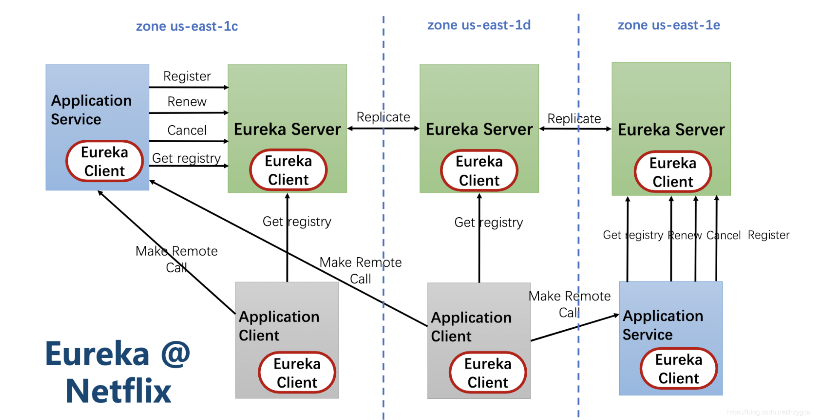
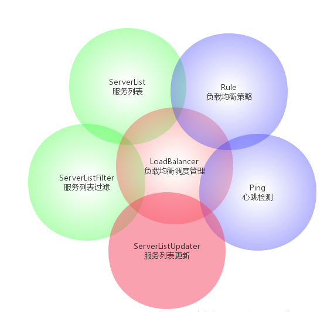
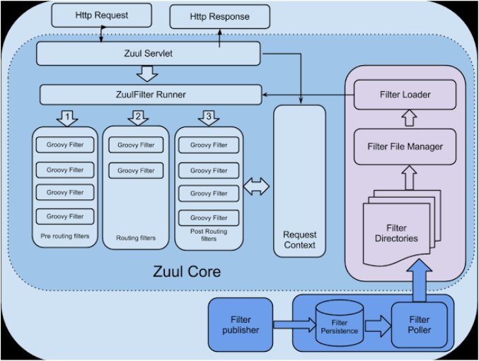

# Spring Cloud核心组件理解（2019.9.8）

## 1.Spring Cloud典型核心组件

+ ### 服务发现——Eureka

+ ### 客服端负载均衡——Ribbon

+ ### 断路器——Hystrix

+ ### 动态代理——Feign

+ ### 服务网关——Zuul

## 2.具体介绍

### 2.1.Eureka

#### 2.1.1.what

##### Eureka 是 Netflix的子模块之一， 用于实现服务注册与发现，是微服务架构中最为核心和基础的模块。Eureka有两个组件：一个是EurekaServer，用于定位服务以实现中间层服务器的负载均衡和故障转移；另个一是EurekaClient（集成在我们的微服务中），用于与Server进行交互，并可以通过服务标识符去获取服务。 Spring Cloud 基于 Netflix Eureka做了二次封装，主要负责完成微服务架构中的服务治理功能。

#### 2.1.2.基础架构

+ ##### **服务注册中心:** Eureka提供的服务端，提供服务注册于发现功能

+ ##### **服务提供者:** 提供服务的应用，可以是spring boot应用，也可以是其他技术平台且遵循Eureka通信机制的应用。

+ ##### **服务消费者:** 消费者应用从服务注册中心获取服务列表，从而使消费者可以知道去何处调用其所需要的服务。

#### 2.1.3.服务治理机制

##### 服务启动后向Eureka注册，Eureka Server会将注册信息向其他Eureka Server进行同步，当服务消费者要调用服务提供者，则向服务注册中心获取服务提供者地址，然后会将服务提供者地址缓存在本地，下次再调用时，则直接从本地缓存中取，完成一次调用。

##### 当服务注册中心Eureka Server检测到服务提供者因为宕机、网络原因不可用时，则在服务注册中心将服务置为DOWN状态，并把当前服务提供者状态向订阅者发布，订阅过的服务消费者更新本地缓存。

##### 服务提供者在启动后，周期性（默认30秒）向Eureka Server发送心跳，以证明当前服务是可用状态。Eureka Server在一定的时间（默认90秒）未收到客户端的心跳，则认为服务宕机，注销该实例。

### 2.2.Ribbon

#### 2.2.1.what

##### Ribbon是一个基于HTTP和TCP的客户端负载均衡器，它可以在通过客户端中配置的ribbonServerList服务端列表去轮询访问以达到服务均衡的作用。当Ribbon和Eureka联合使用时，Ribbon的服务实例清RibbonServerList会被DiscoveryEnabledNIWSServerList重写，扩展成从Eureka注册中心中获取服务端列表。同时它也会用NIWSDiscoveryPing来取代IPing，它将职责委托给Eureka来去定服务端是否已经启动。

#### 2.2.2.Ribbon主要组件：

+ ##### ServerList:定义获取服务器列表

+ ##### ServerListFilter:对ServerList服务器列表进行二次过滤

+ ##### ServerListUpdater: 定义服务更新策略

+ ##### IPing: 检查服务列表是否存活

+ ##### IRule :根据算法中从服务列表中选取一个要访问的服务

+ ##### ILoadBalancer:软件负载平衡器入口，整合以上所有的组件实现负载功能

  

##### 在客户端负载均衡中，所有客户端节点都维护着自己要访问的服务端清单，而这些服务端的清单来自于服务注册中心（比如Eureka）。在客户端负载均衡中也需要心跳去维护服务端清单的健康性，只是这个步骤需要与服务注册中心配合完成。

##### 通过Spring Cloud Ribbon的封装，我们在微服务架构中使用客户端负载均衡调用只需要如下两步：

+ ##### 服务提供者只需要启动多个服务实例并且注册到一个注册中心或是多个相关联的服务注册中心

+ ##### 服务消费者直接通过调用被@LoadBalanced注解修饰过的RestTemplate来实现面向服务的接口调用

### 2.3.Hystrix

#### 2.3.1.what

##### 在微服务架构中，存在着那么多的服务单元，若一个单元出现故障，就很容易因依赖关系而引发故障的蔓延，最终导致整个系统的瘫痪，这样的架构相较传统架构更加不稳定。为了解决这样的问题，产生了断路器等一系列的服务保护机制。

##### 在分布式架构中，当某个服务单元发生故障之后，通过断路器的故障监控，向调用方返回一个错误响应，而不是长时间的等待。这样就不会使得线程因调用故障服务被长时间占用不释放，避免了故障在分布式系统中的蔓延。

##### Hystrix具备服务降级、服务熔断、线程和信号隔离、请求缓存、请求合并以及服务监控等强大功能。

##### Hystrix使用舱壁模式实现线程池的隔离，它会为每一个依赖服务创建一个独立的线程池，这样就算某个依赖服务出现延迟过高的情况，也只是对该依赖服务的调用产生影响，而不会拖慢其他的依赖服务。

#### 2.3.2.特性

+ ##### 请求熔断： 当Hystrix Command请求后端服务失败数量超过一定比例(默认50%)，断路器会切换到开路状态(Open)。这时所有请求会直接失败而不会发送到后端服务，断路器保持在开路状态一段时间后(默认5秒),，自动切换到半开路状态(HALF-OPEN)。 这时会判断下一次请求的返回情况, 如果请求成功, 断路器切回闭路状态(CLOSED), 否则重新切换到开路状态(OPEN). Hystrix的断路器就像我们家庭电路中的保险丝, 一旦后端服务不可用, 断路器会直接切断请求链, 避免发送大量无效请求影响系统吞吐量, 并且断路器有自我检测并恢复的能力。

+ ##### 服务降级：Fallback相当于是降级操作。对于查询操作，我们可以实现一个fallback方法，当请求后端服务出现异常的时候，可以使用fallback方法返回的值。fallback方法的返回值一般是设置的默认值或者来自缓存。告知后面的请求服务不可用了，不要再来了。

+ ##### 依赖隔离(采用舱壁模式，Docker就是舱壁模式的一种)：在Hystrix中，主要通过线程池来实现资源隔离。 通常在使用的时候我们会根据调用的远程服务划分出多个线程池，比如说，一个服务调用另外两个服务，你如果调用两个服务都用一个线程池，那么如果一个服务卡在哪里，资源没被释放，后面的请求又来了，导致后面的请求都卡在哪里等待，导致你依赖的A服务把你卡在哪里，耗尽了资源，也导致了你另外一个B服务也不可用了。这时如果依赖隔离，某一个服务调用A B两个服务，如果这时我有100个线程可用，我给A服务分配50个，给B服务分配50个，这样就算A服务挂了，我的B服务依然可以用。

+ ##### 请求缓存：比如一个请求过来请求我userId=1的数据，你后面的请求也过来请求同样的数据，这时我不会继续走原来的那条请求链路了，而是把第一次请求缓存过来，把第一次的请求结果返回给后面的请求。

+ ##### 请求合并：我依赖于某一个服务，我要调用N次，比如说查数据库的时候，我发了N条请求发了N条SQL然后拿到一堆结果，这时候我们可以把多个请求合并成一个请求，发送一个查询多条数据的SQL的请求，这样我们只需查询一次数据库，提升了效率。

### 2.4.Feign

#### 2.4.1.what

##### Feign是一个声明式的web服务客户端,使得编写web服务客户端变得非常容易。只需创建一个接口,然后在上面添加注解即可。Spring Cloud对Feign进行了封装，使其支持Spring MVC标准注解和HttpMessageConverters。Feign可以与Eureka和Ribbon组合使用以支持负载均衡。

#### 2.4.2.关键机制

+ ##### 首先，对某个接口定义了@FeginClient注解，Fegin就会针对这个接口创建一个动态代理

+ ##### 接着调用接口的时候，本质就是调用Fegin创建的动态代理

+ ##### Fegin的动态代理会根据在接口上的@RequestMapping等注解，来动态构造要请求的服务的地址

+ ##### 针对这个地址，发起请求、解析响应

#### 2.4.3.和Ribbon以及Eureka紧密协作

+ ##### 首先Ribbon会从Eureka Client里获取到对应的服务注册表，也就知道了所有的服务都部署在了哪些机器上，在监听哪些端口

+ ##### 然后Ribbon就可以使用默认的Round Robin算法，从中选择一台机器

+ ##### Fegin就会针对这台机器，构造并发起请求

### 2.5.Zuul

#### 2.5.1.what

##### Spring Cloud Zuul通过与Spring Cloud Eureka进行整合，将自身注册为Eureka服务治理下的应用，同时从Eureka中获得了所有其他微服务的实例信息。对于路由规则的维护，Zuul默认会将通过以服务名作为ContextPath的方式来创建路由映射。Zuul提供了一套过滤器机制，可以支持在API网关无附上进行统一调用来对微服务接口做前置过滤，已实现对微服务接口的拦截和校验。它可以和Eureka、Ribbon、Hystrix等组件配合使用，它主要用作反向代理、Filter扩展、动态加载、动态路由、压力测试、弹性扩展、审查监控、安全检查等。

#### 2.5.2.功能

+ **身份验证和安全性 - 确定每个资源的身份验证要求并拒绝不满足这些要求的请求**
+ **洞察和监控 - 在边缘跟踪有意义的数据和统计数据，以便为我们提供准确的生产视图**
+ **动态路由 - 根据需要动态地将请求路由到不同的后端群集**
+ **压力测试 - 逐渐增加群集的流量以衡量性能**
+ **Load Shedding - 为每种类型的请求分配容量并删除超过限制的请求**
+ **静态响应处理 - 直接在边缘构建一些响应，而不是将它们转发到内部集群**

#### 2.5.3.组件

+ **zuul-core--zuul核心库，包含编译和执行过滤器的核心功能**。
+ **zuul-simple-webapp--zuul Web应用程序示例，展示了如何使用zuul-core构建应用程序**。
+ **zuul-netflix--lib包，将其他NetflixOSS组件添加到Zuul中，例如使用功能区进去路由请求处理**。
+ **zuul-netflix-webapp--webapp，它将zuul-core和zuul-netflix封装成一个简易的webapp工程包**。